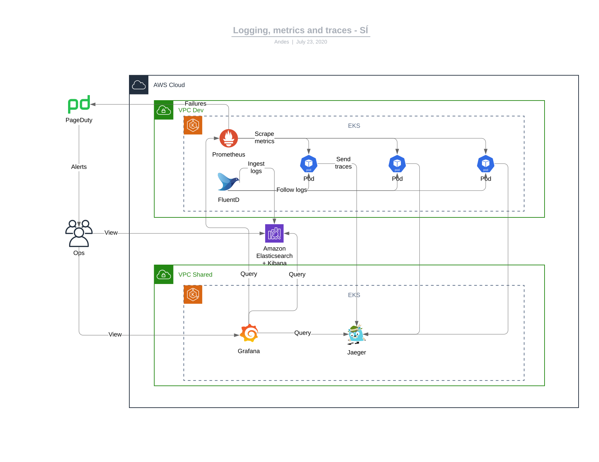

# Observability

# Intro

We need to ensure that the applications stay available and performant once they have been deployed to Production. For that to happen we need all of these things to happen:

- Provide observability into the applications
- Define the boundaries of expected behaviour
- Document applications' components and their maintenance operations
- Contact information for dev team emergency contact

## What is observability

Here is a [sample chapter from the book Distributed Systems Observability by Cindy Sridharan](https://www.oreilly.com/library/view/distributed-systems-observability/9781492033431/ch04.html) that talks about the three pillars of observability - logs, metrics and traces. We are starting with these basics and we are planning to add more - stack-trace collection, deployment events, etc.

## Setup

All AWS services that we use send their logs to AWS CloudWatch. This is in addition to the copy of the logs stored in the AWS Logs account. Additionally we have an AWS ElasticSearch instance running in our Shared AWS account where we store _all_ logs from _all_ applications running in _all_ our Kubernetes clusters. We have deployed FluentD in the Kubernetes clusters which takes care of delivering automatically all logs to central ElasticSearch.

For storing and querying metrics we use [Prometheus](https://prometheus.io) which is also deployed in each Kubernetes cluster and collects metrics from all applications running there. AWS services send their metrics to AWS CloudWatch.

Tracing - TBD.

To search through the logs we use [Kibana](https://kibana.shared.devland.is). It is a powerful way to search logs across different apps running in different environments.

Grafana - TBD.
